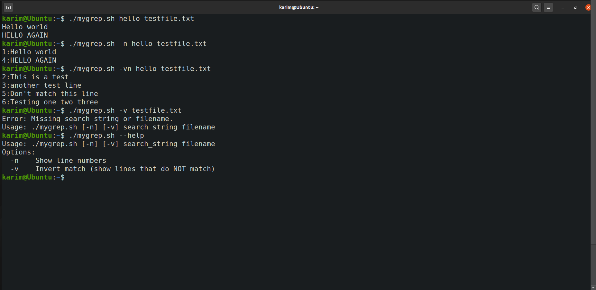
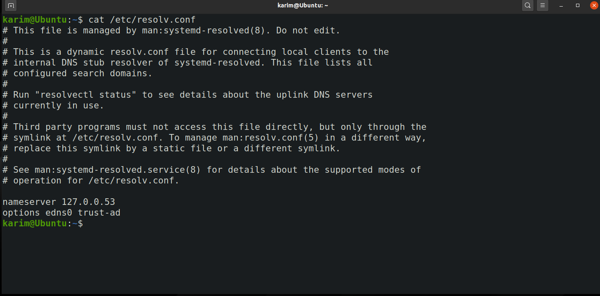
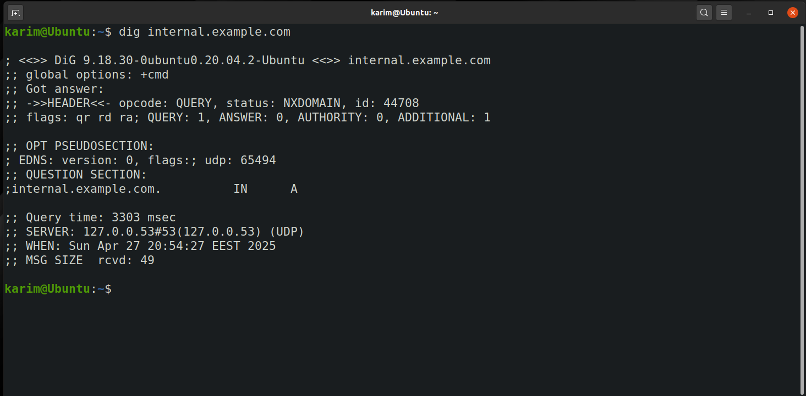
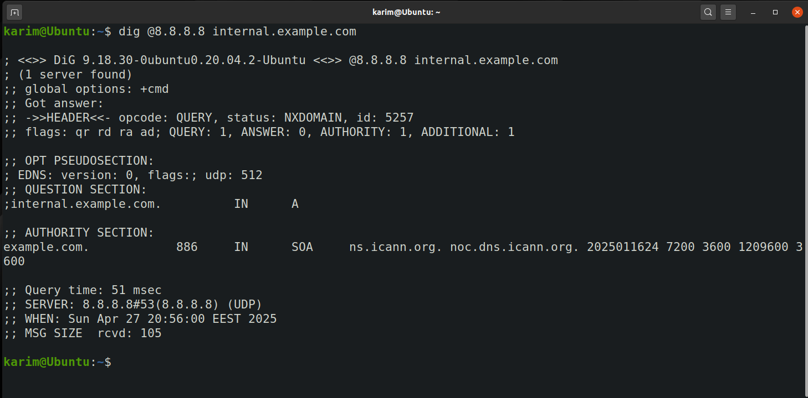
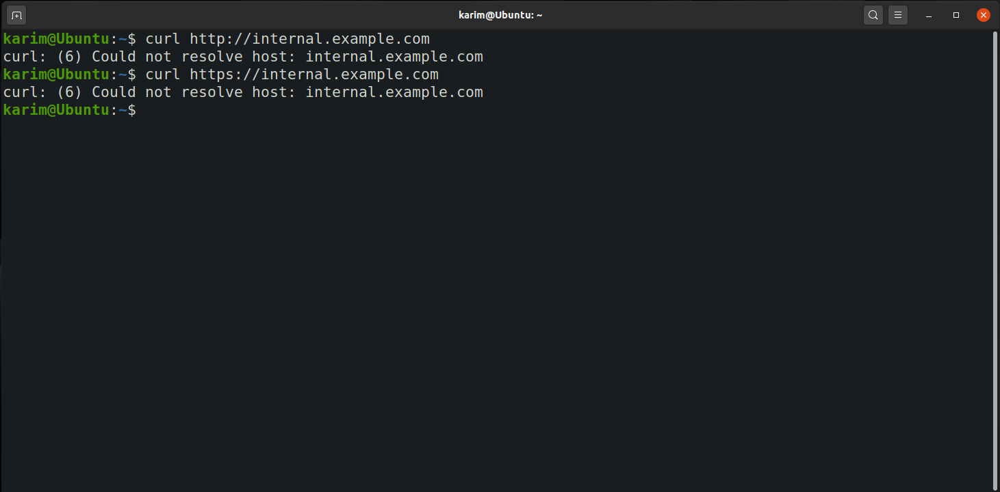

# Internship Tasks

# Q1: Implementing mygrep

## Overview

  

In this task, I implement `mygrep.sh`, a basic version of the `grep` command.

  

**Features:**

- Search for a string (case-insensitive) in a text file.

- Supports options:

- `-n`: Show line numbers.

- `-v`: Invert match (show non-matching lines).

- Options can be combined (`-vn` or `-nv`).

- Handles missing arguments and missing files.

- `--help` shows usage instructions.

  

---

  

## Demo (Screenshot)

  



  

Cases tested:

- `./mygrep.sh hello testfile.txt`

- `./mygrep.sh -n hello testfile.txt`

- `./mygrep.sh -vn hello testfile.txt`

- `./mygrep.sh -v testfile.txt` (error for missing search string)
- `./mygrep.sh --help` 

  

---

  

## Reflection

  

### 1. How arguments and options are handled

- `getopts` parses `-n` and `-v`.

- After options are processed, `$1` is the search string and `$2` is the filename.

- The script checks for missing arguments or invalid files.

- It reads the file line-by-line, applies case-insensitive matching, and handles inversion (`-v`) and line numbering (`-n`) based on the flags.

  

### 2. How structure would change for regex or more options

- For regex support, the matching logic would be updated to handle patterns, not just fixed strings.

- For options like `-i`, `-c`, or `-l`, extra flags would be added, and the script would branch based on the selected behaviors (e.g., counting matches instead of printing lines).

  

### 3. Hardest part

- Handling combined options (`-n` and `-v`) correctly was the trickiest part, especially making sure inversion didn't interfere with line numbering.

- Another small challenge was making the line reading safe (preserving spaces and special characters).

  

---

  

## Bonus

- Added `--help` for usage.

- Used `getopts` for clean option parsing.

---

# Q2: Troubleshooting Internal Service Unreachability


## 1. Verifying DNS Resolution

First, I checked the system's current DNS settings using:

```bash
cat /etc/resolv.conf

```


This showed the current nameservers configured on the system.

Then, I attempted to resolve `internal.example.com` using both the system's DNS and Google's public DNS (`8.8.8.8`) for comparison:

```bash
dig internal.example.com
dig @8.8.8.8 internal.example.com

```



### Findings:

-   DNS resolution **failed** in both cases (`NXDOMAIN` error received).
    
-   This confirmed that `internal.example.com` was not resolving via either the internal DNS or a public DNS.
    
-   Therefore, the issue likely stems from missing internal DNS records or misconfigured DNS settings.
    
----------

## 2. Diagnosing Service Reachability

Since DNS resolution failed, I attempted to verify service reachability:

```bash
curl http://internal.example.com
curl https://internal.example.com
```

### Findings:

-   All attempts to connect failed with "Could not resolve host" errors.
    
-   As expected, without DNS resolution, the service could not be reached by domain name.   

----------

## 3. Possible Causes of the Issue

I identified the following potential causes for the problem:

1. **Incorrect DNS server settings** in `/etc/resolv.conf`

2. **Internal DNS server down** or unreachable

3. **Missing internal DNS records** for `internal.example.com`

4. **Firewall rules** blocking DNS traffic (port 53)

5. **Routing issues** preventing network access to the server

6. **Firewall rules** blocking HTTP/HTTPS ports (80/443)

7. **Web service down** (even if server is reachable)

----------

## 4. Proposed Confirmations and Fixes

For each potential cause, I proposed the following troubleshooting steps and fixes:

----------

### Cause 1: Incorrect DNS Settings

-   **Confirm:** Check `/etc/resolv.conf` for correct nameservers.
    
-   **Fix:**
    
    ```bash
    sudo nano /etc/resolv.conf
    # Update with correct internal DNS server IP
    ```
    
-   **Persistent Fix:** Using `systemd-resolved`
    
    ```bash
    sudo nano /etc/systemd/resolved.conf
    # Add:
    DNS=<internal_dns_ip>
    FallbackDNS=8.8.8.8
    sudo systemctl restart systemd-resolved
    ```
----------

### Cause 2: Internal DNS Server Down

-   **Confirm:** Ping the DNS server IP or attempt direct `dig` queries.
    
    ```bash
    ping <dns-server-ip>
    dig @<dns-server-ip> internal.example.com
    ```
    
-   **Fix:** Restart DNS services on the server.
    

----------

### Cause 3: Missing DNS Records

-   **Confirm:** Query the DNS server directly.
    
    ```bash
    dig @<dns-server-ip> internal.example.com
    ```
    
-   **Fix:** Add missing A record for `internal.example.com` on the DNS server.
    

----------

### Cause 4: Firewall Blocking DNS

-   **Confirm:** Test DNS port (53) using `nc` or check firewall settings.
    
    ```bash
    nc -zv <dns-server-ip> 53
    sudo ufw status
    ```
    
-   **Fix:**
    
    ```bash
    sudo ufw allow 53
    ```
    

----------

### Cause 5: Routing Issues

-   **Confirm:** Use `ping` and `traceroute` to test network path.
    
    ```bash
    ping <server-ip>
    traceroute <server-ip>
    ```
    
-   **Fix:** Correct static routes.
    

----------

### Cause 6: Firewall Blocking Web Ports

-   **Confirm:** Use `nc` to test ports 80/443.
    
    ```bash
    nc -zv <server-ip> 80
    nc -zv <server-ip> 443
    ```
    
-   **Fix:**
    
    ```bash
    sudo ufw allow 80
    sudo ufw allow 443
    ```
    

----------

### Cause 7: Web Service Down

-   **Confirm:** SSH into the server and check service status.
    
    ```bash
    sudo systemctl status apache2
    # or
    sudo systemctl status nginx
    ```
    
-   **Fix:** Restart web service if needed.
    
    ```bash
    sudo systemctl restart apache2
    # or
    sudo systemctl restart nginx
    ```
    

----------

## Bonus: Local /etc/hosts Configuration

Since DNS resolution was failing, we can configure a temporary `/etc/hosts` entry for testing:

```bash
sudo nano /etc/hosts
# Added:
192.168.1.100 internal.example.com
```

After this, we can access the service locally using:

```bash
curl http://internal.example.com
```

This bypasses the need for DNS resolution and confirms that the service itself was reachable when the correct IP was known.

----------

## Bonus: Persisting DNS Settings

To ensure DNS settings persist across reboots:

-   Using **systemd-resolved**:
    
    ```bash
    sudo nano /etc/systemd/resolved.conf
    # Set:
    DNS=<internal_dns_ip>
    FallbackDNS=8.8.8.8
    sudo systemctl restart systemd-resolved
    ```
   

